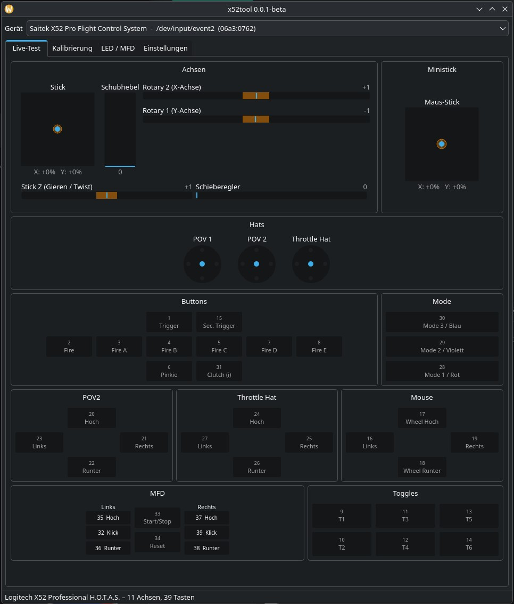
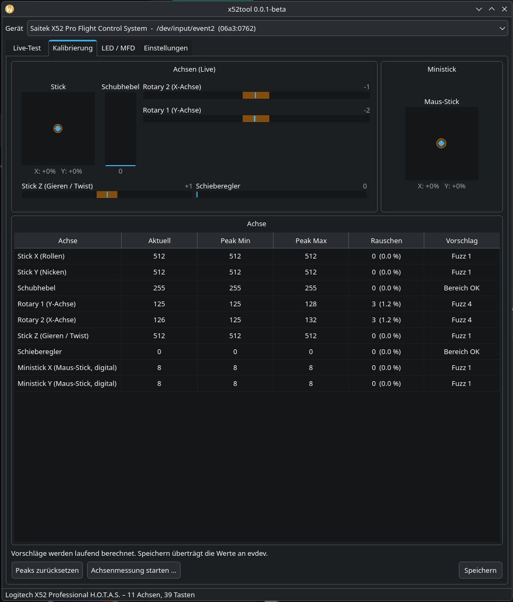
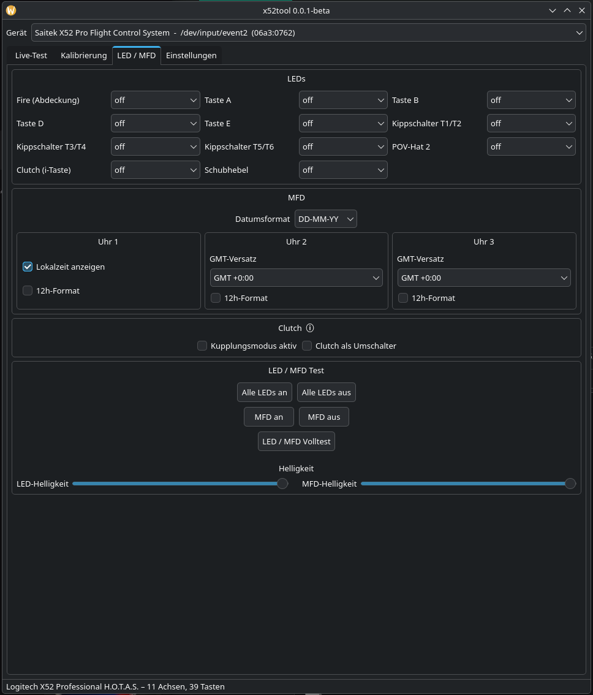
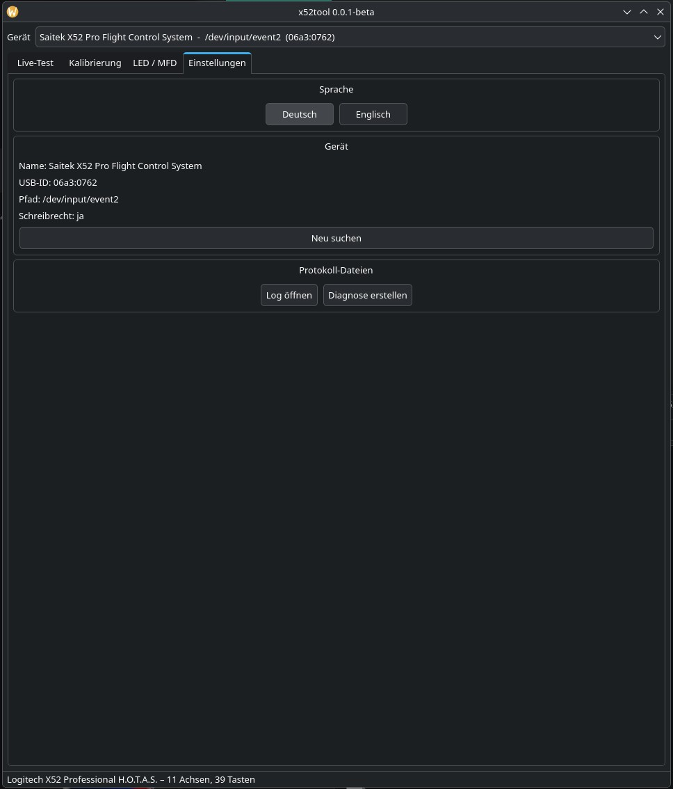

# x52tool

**Test, calibration and LED/MFD tool for the Saitek / Logitech X52 and X52 Pro on Linux.**

| | | | |
|---|---|---|---|
|  |  |  |  |

`x52tool` is a native Linux GUI for the X52 and X52 Pro HOTAS. It shows what Linux sees from the device, lets you test axes and buttons in real time, calibrate axes, and control LEDs and the MFD display — all without a daemon or Windows driver.

Tested on: **Logitech X52 Professional** (USB-ID `06a3:0762`) on **CachyOS** (Arch-based).

---

## Features

### Live Test
- Real-time display of all axes and buttons as reported by Linux `evdev`
- Axis bars with deadzone indicator
- Button grid with live highlighting
- Ministick shown separately

### Calibration
- Guided axis measurement (min/max peak detection, one axis at a time)
- Noise and centre offset display
- Deadzone and fuzz suggestions based on measured values
- Write calibration directly to the kernel via `EVIOCSABS`
- Save and load calibration profiles per USB-ID

### LED / MFD
- Set individual LED colours (Fire, A, B, D, E, T1/T2, T3/T4, T5/T6, POV2, Clutch, Throttle)
- MFD clock: local time, 12/24h format, date format, timezone offsets for Clock 2 and Clock 3
- MFD brightness and LED brightness sliders (live)
- All LEDs on / All LEDs off / MFD on / MFD off
- Full LED/MFD test sequence with closing display text
- Clutch mode toggle

### Settings
- Device info block with rescan button
- Language switching (German / English)
- Log file access and diagnostic report generation

---

## Requirements

- Linux
- Python 3.10 or newer
- PyQt6
- python-evdev
- Saitek / Logitech X52 or X52 Pro
- `libx52` (`x52cli`) for LED and MFD control

---

## Installation

### CachyOS / Arch

Install Python dependencies:

```bash
pip install pyqt6 evdev --break-system-packages
```

Or using a virtual environment:

```bash
python3 -m venv .venv
.venv/bin/pip install -r requirements.txt
```

Or install directly from GitHub:

```bash
pip install git+https://github.com/nemwar-ed/x52tool.git --break-system-packages
```

Install `libx52` from the AUR:

```bash
yay -S libx52
```

Run the tool:

```bash
python3 -m x52tool
```

Or with the virtual environment:

```bash
.venv/bin/python -m x52tool
```

### USB permissions for LEDs and MFD

`x52cli` accesses the USB device directly. A udev rule is required for non-root access.

For the X52 Pro (`06a3:0762`), create `/etc/udev/rules.d/60-x52tool.rules`:

```
SUBSYSTEMS=="usb", ATTRS{idVendor}=="06a3", ATTRS{idProduct}=="0762", MODE="0666"
```

Then reload and reconnect:

```bash
sudo udevadm control --reload-rules
```

Unplug and replug the X52 Pro.

---

## Command line

List detected devices without launching the GUI:

```bash
python3 -m x52tool --list
```

Apply a saved calibration profile:

```bash
python3 -m x52tool --apply
python3 -m x52tool --apply --device /dev/input/event7
```

---

## Project structure

```
x52tool/
├── README.md
├── README.de.md
├── LICENSE
├── requirements.txt
├── run.sh
└── x52tool/
    ├── __init__.py
    ├── __main__.py
    ├── analysis.py
    ├── config.py
    ├── device.py
    ├── logger.py
    ├── output.py
    └── ui/
        ├── calib2_tab.py
        ├── live_tab.py
        ├── main_window.py
        ├── output_tab.py
        ├── settings_tab.py
        └── widgets.py
```

Settings and calibration profiles are stored in:

```
~/.config/x52tool/config.json
```

Log files are stored in:

```
~/.local/share/x52tool/x52tool.log
~/.local/share/x52tool/x52tool-diag.log
```

---

## AI-assisted development

`x52tool` was developed with the assistance of **Anthropic Claude**. All code is reviewed and tested on real Linux / X52 Pro hardware before being committed.

---

## Contributing

Bug reports, tests on other X52 / X52 Pro hardware, and improvements are welcome.

For bug reports, please include:

- Distribution and version
- Kernel version
- X52 or X52 Pro
- Output of `lsusb`
- Output of `python3 -m x52tool --list`
- Any error messages from the terminal
- The diagnostic log from Settings → Create Diagnostic

---

## License

`x52tool` is released under the **GNU General Public License v3.0**. See `LICENSE`.

`libx52` is a separate project with its own license: https://github.com/nirenjan/libx52

---

## Links

- libx52: https://github.com/nirenjan/libx52
- python-evdev: https://python-evdev.readthedocs.io/
- libx52 on AUR: https://aur.archlinux.org/packages/libx52
